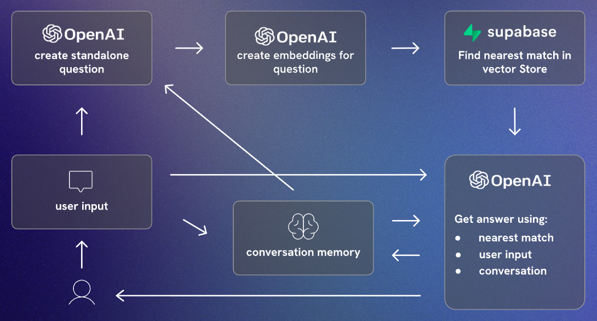

# Scrimba Bot

This is a learning project following the course [Learn LangChain.js](https://scrimba.com/learn-langchainjs-c02t)

The goal is to build a bot that can answer questions about the Scrimba platform.

